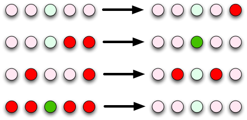

# Arduino-LED-Binary-Counter
### Introduction
The outcomes of this project are:  
• Write a program from only an English description of its behaviour.  
• Understand how arrays of variables work on Arduino.  
• Understand how loops (while and for) work on Arduino.    
• Using loops to avoid repeating code and making code easier to extend.  
• Write a program based on only an English description of its behaviour.  
  
This project is based off a circuit built with 5 LEDs and 2 pushbuttons. The LEDs should mimic a binary counter.

### Desired Behaviour  
Choose one button, it will be the increment button. Every time the increment button is pressed, the first LED in the row should be turned on. If it is already turned on, turn it off instead and turn on the second LED. If the second LED is also already on, turn it off too, and turn on the third LED. If it too is already on, keep repeating this procedure until an LED can be turned on, or until there are no more LEDs (thus all of the LEDs should be turned off). When the increment button is pressed again the whole procedure is followed from scratch. Here's four examples of how the lights should change when the button is pressed.

Choose the other button, it will be the decrement button. Every time the decrement button is pressed, the first LED in the row should be turned off. If it is already turned off, turn it on instead and turn off the second LED. If the second LED is also already off, turn it on too, and turn off the third LED. If it too is already off, keep repeating this procedure until an LED can be turned off, or until there are no more LEDs (thus all of the LEDs should be turned on). When the decrement button is pressed again the whole procedure is followed from scratch. Here's four examples of how the lights should change when the button is pressed.
  
### Thought Questions:  
1. How many times do you have to press the button before the green LED (i.e., the middle LED of 5) is lit?  
  Answer: 2^(LED Number - 1) = 2^(3 - 1) = 4  
  
2. How many times do you have to press the button before the last LED (i.e., the fifth LED) is lit?  
  Answer: 2^(LED Number - 1) = 2^(5 - 1) = 16
  
3. What if you added one more LED, how many times before this sixth LED is lit?  
  Answer: 2^(LED Number - 1) = 2^(6 - 1) = 32
  
### Accessories used:  
5 x 560 Ohm (Grn Blu Brown) resistor  
5 x LED  
1 x Arduino Mega Board (AMG)  
2 x 10k Ohm resistor  
2 x 10uF Capacitor  
2 x Push button  
  
### Wiring instructions:  
Arduino Pin 9 to 13 <--> Resistor <--> Longer LED lead |LED| Shorter LED lead <---> Arduino GND  
Buttons  
Arduino Pin 2 and 3 <--> Top Left of Button <--->Bottom Left of Button<-->Resistor <---> Arduino GND  
  
Increment Button PIN 3 with capacitor in parallel  
  
Decrement Button PIN 2  with capacitor in parallel  
  
LEDs PINs 9 through 13  
  
### Special notes: 

This project was compiled on the arduino Virtual Machine provided by the University of Alberta Dept. of Computing Science.
  
There is a delay of 300 ms per button press, if you hold the button down longer, the LEDs will advance to the next state.  
